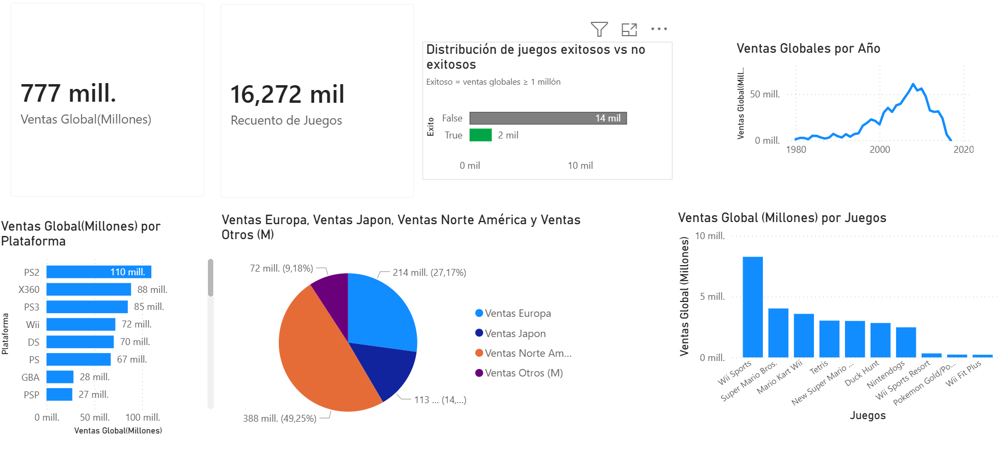

# 🎮 Análisis de Ventas de Videojuegos con Python y Power BI

Este proyecto analiza las ventas globales de videojuegos desde 1980 hasta 2017, con el objetivo de identificar tendencias temporales, plataformas dominantes, regiones clave y los juegos con mayor impacto comercial.

El proyecto cubre todo el flujo de trabajo de un análisis de datos: limpieza, exploración, agregación y visualización final mediante Power BI.

---

## 🧠 Objetivos del análisis

- Analizar la evolución temporal de las ventas globales de videojuegos
- Identificar las plataformas con mayor volumen de ventas
- Comparar el peso de las diferentes regiones (NA, EU, JP, Other)
- Detectar los videojuegos más exitosos a nivel mundial
- Construir un dashboard interactivo para la toma de decisiones

---

## 🛠️ Tecnologías utilizadas

- **Python** (pandas, numpy)
- **Jupyter Notebook**
- **Power BI**
- **Excel**
- **GitHub**

---

## 📂 Estructura del proyecto

- **data/raw/**: datos originales sin procesar  
- **data/processed/**: datasets limpios y agregados listos para análisis  
- **notebooks/**: notebooks de limpieza y análisis exploratorio  
- **powerbi/**: archivo del dashboard final en Power BI  
- **images/**: capturas del dashboard

---

## 📊 Dashboard en Power BI

El dashboard permite explorar de forma interactiva las ventas globales por plataforma, región, año y videojuego.

---

## 🔍 Principales insights

- Las ventas globales alcanzan su máximo entre 2005 y 2010
- PlayStation 2 y Xbox 360 lideran las ventas por plataforma
- Norteamérica representa la mayor proporción de ventas globales
- Un pequeño número de juegos concentra gran parte de las ventas

